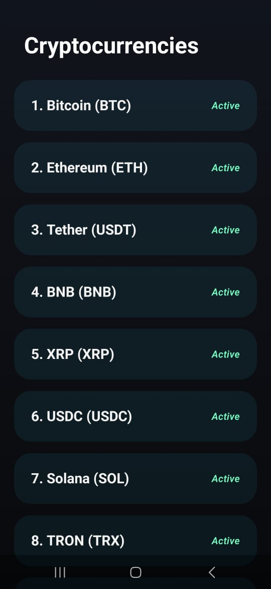
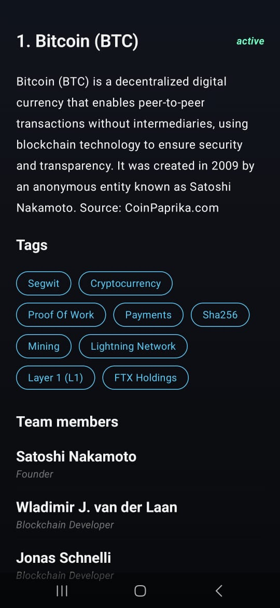

# 🪙 CryptoWatch - Advanced Cryptocurrency Tracker

A production-ready, high-performance Android application built to demonstrate modern Android development best practices. The project showcases a robust offline-first architecture, complex reactive UI design using Jetpack Compose, and asynchronous data flowing from a REST API utilizing standard enterprise design patterns.

---

## 📸 App Preview

<table>
  <tr>
    <td align="center"><b>Coin Market List</b></td>
    <td align="center"><b>Coin Deep Details</b></td>
  </tr>
  <tr>
    <td></td>
    <td></td>
  </tr>
</table>

---

## 🏗️ Architectural Pattern & Design Philosophy

The core of this application is engineered around **Clean Architecture** principles combined with the **MVVM (Model-View-ViewModel)** presentation pattern. This separation ensures that the codebase remains highly scalable, maintainable, modular, and completely testable.

### Key Architectural Pillars:
* **Domain Layer (Core Business Logic):** Completely decoupled from UI frameworks and external data sources. Contains pure Kotlin business models and abstract definitions (Repositories).
* **Data Layer (Infrastructure & Persistence):** Responsible for data operations. Implements the Repository pattern to orchestrate operations between remote network layers.
* **Presentation Layer (UI & State Management):** Purely declarative UI using **Jetpack Compose**. It leverages unidirectional data flow (UDF) managed by architectural ViewModels.

   [ Presentation Layer (Jetpack Compose / ViewModels) ]
                            |
                            v
         [ Domain Layer (Pure Business Logic) ]
                            ^
                            |
         [ Data Layer (Retrofit / API Service) ]

---

## 🛠️ Modern Tech Stack & Tools

* **UI Framework:** [Jetpack Compose](https://developer.android.com/jetpack/compose) – Declarative UI toolkit for building native, reactive interfaces.
* **Asynchronous Engine:** [Kotlin Coroutines & Flow](https://kotlinlang.org/docs/coroutines-overview.html) – Reactive streams providing asynchronous execution pipelines with built-in structured concurrency.
* **Dependency Injection (DI):** [Dagger Hilt (v2.51)](https://developer.android.com/training/dependency-injection/hilt-android) – Enterprise-grade compile-time dependency injection ensuring loose coupling and effortless testability.
* **Compiler Optimization:** [KSP (Kotlin Symbol Processing)](https://kotlinlang.org/docs/ksp-overview.html) – Next-generation metadata processing engine, yielding up to 2x faster build compilation times compared to legacy KAPT.
* **Networking Layer:** [Retrofit 2](https://square.github.io/retrofit/) + **Gson** – Type-safe, high-speed HTTP client equipped with custom serialization interceptors.
* **Lifecycle Management:** Architectural ViewModels, Compose BOM, State LiveData Integration.

---

## ⚡ Key Highlights 

### 1. Robust Dependency Injection (DI) Lifecycle Management
Instead of manual object instantiation, **Dagger Hilt** is strictly integrated across the app. Components are properly scoped to their respective Lifecycles (`@Singleton` for network clients, `@ActivityRetainedScoped` for UI state providers), eliminating any risk of memory leaks.

### 2. State Management & Unidirectional Data Flow (UDF)
The application avoids UI bugs by establishing a single source of truth. The ViewModel exposes immutable states to Compose screens via Kotlin flows. UI elements emit events up, and the ViewModel drives state down.

### 3. Scalable Network Handling & Serialization
Includes custom HTTP handling mechanisms through Retrofit, featuring structured data models capable of parsing real-time highly volatile cryptocurrency parameters cleanly, using Java 17 toolchains.

### 4. Optimized Build System Configs
The build script (`build.gradle.kts`) is fine-tuned to industry standards:
* **Java 17 / JVM 17 Target Enforcement:** Utilizing advanced bytecode features and strict compiler optimizations.
* **Metadata Stripping:** Proactive exclusion of duplicate software license footprints (`LICENSE.md`, `NOTICE`) within build binaries to minimize final APK size.

---

## 📂 Modular Package Structure

```text
com.example.crypto
├── data
│   ├── model          # Network DTOs & Domain mappers
│   └── repository     # Concrete data implementations
├── di                 # Hilt Dependency Injection Modules
├── domain
│   ├── model          # Pure business logic entities
│   └── repository     # Abstract data contracts
└── presentation
    ├── coin_list      # UI Composables & ViewModels for list screen
    ├── coin_detail    # UI Composables & ViewModels for details screen
    └── ui/theme       # Centralized design system tokens (Color, Type)

